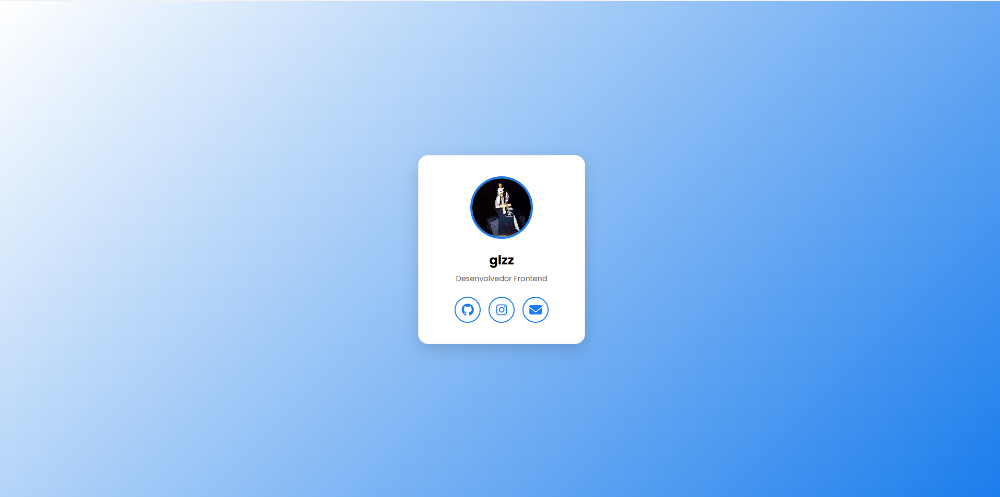

# Digital Card - glzzdolor

Um cartão de visita digital minimalista, moderno e responsivo. Desenvolvido com foco em interface limpa e boa experiência do usuário para facilitar o contato profissional ou casual.

## 🚀 Tecnologias Utilizadas

- **HTML5**: Estrutura do cartão.
- **CSS3**: Estilização, layout Flexbox e design responsivo.
- **JavaScript**: Lógica de cópia para área de transferência e manipulação de eventos.
- **FontAwesome**: Ícones profissionais para redes sociais.
- **Google Fonts**: Tipografia moderna (Poppins).

## 💡 Principais Funcionalidades

- **Design Minimalista**: Paleta de cores focada em azul, branco e preto.
- **Interatividade**: Função de copiar e-mail com feedback visual.
- **Responsividade**: Layout adaptável para dispositivos móveis e desktops.
- **Hover Effects**: Efeitos visuais suaves ao passar o mouse pelos links.

## 📸 Pré-visualização

## 🔗 Acesso ao Projeto

Você pode visualizar a versão final aqui: **https://mydigitalcard-glzzdolor.vercel.app**
